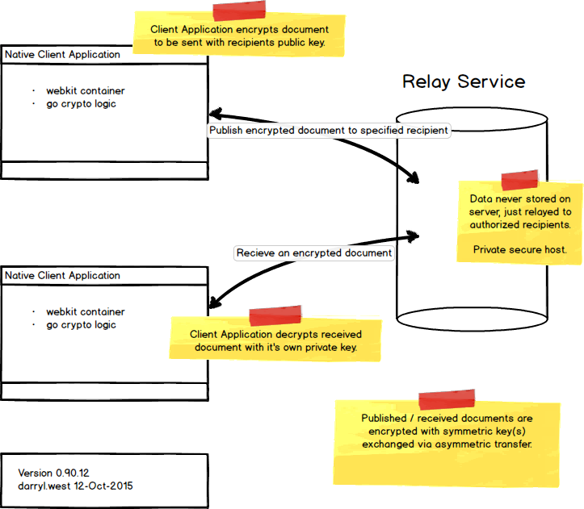

# VSRI Private Document Exchange

## Overview

The risk areas for secure document exchange include...

* data transmission, man-in-the-middle attacks
* data at rest being compromised by a hacker through disk or memory
* authentication breech caused by careless users, weak passwords, etc
* authentication breech caused by stolen device

Our solution addresses these risks by creating a secure client-to-client environment where only the recipient has the ability to decrypt the received document.   Each user would have their own copy of the natively compiled client application, with secure key generation.

Combining hmac document signatures with secure sockets solves the man-in-the-middle risk.  Using machine keys with hight entropy to encrypt sensitive documents solves the careless user/weak password risk.

Our relay service acts as temporary storage until the recipient requests a document published specifically for them.  This solves the data-at-rest risk.

Client applications include additional back-channel methods of authenticating users via two-factor authentication using time based one-time passwords, biometrics and/or private channel devices.  This additional authentication solves the stolen device risk.

## Authentication

### Whitelisted User Base

All users connected to the system must go through a white-listing process.  This includes identifying persons, machines, and the hosting environments that they belong to.  A user's connection is always based on a validated list, otherwise the connection is rejected.

## Document Exchange Technology

### Client Application

The client application has the ability to send out it's public key to the relay server and recieve encrypted data based on the public key.  Encrypted data usually includes a symmetric key to be used by other cooperating clients.

Client applications are written in nw.js (NodeWebkit) with low-level exchanges done in go.  Target environments include Windows, MacOSX and Linux.  Phase 2 versions support iOS/iPad/iPhone.

* client applications compiled for Windows, Mac and Linux
* client application can act as a document producer or consumer
* as a recipient, read only documents would not be stored
* read/write documents would enable changes to the document to be transmitted back to the publisher
* admin documents would provide the ability to store the document on the recipient's device (they then potentially become a content producer)
* all exchanges would use the a symmetric key to encrypt data by the producer and decrypt by the receiver
* all exchanges travel through the relay server as a temporary holding area until the recipient is ready to receive

### Relay Service

The relay service operates over secure websockets, only handles encrypted anonymous data transfers, and never persists data.  For memory and disk safe operation, the relay service is hosted on a private, secure server.

The main features/functions are...

* handle document transfer requests from publishers by buffering data (nothing permanently saved to disk)
* handle recipient requests to pull a specified document
* receive data from publishers via secure websockets and hold in memory
* transfer data to recipients via secure websockets
* send out back-channel authentication request
* process back-channel authentications

The relay service would be written in go, a compiled language.  TLS1.2+ would be used for all transfers.  Back channel communications would be delivered through SMS, email and/or custom service.

## Summary

This solution leverages the relatively small user set (10K) to create an exchange environment that does not rely on user passwords.  Back channel authentication provides authentication through biometrics or other secure methods.  This level of security would be impossible to do inside a browser based application.

The relay system anonymously takes bits of encrypted data and holds it for transfer to the specified recipient who has the only capability to decrypt the data.
- - -
darryl.west@roundpeg.com
version 0.90.12 12-Oct-2015
